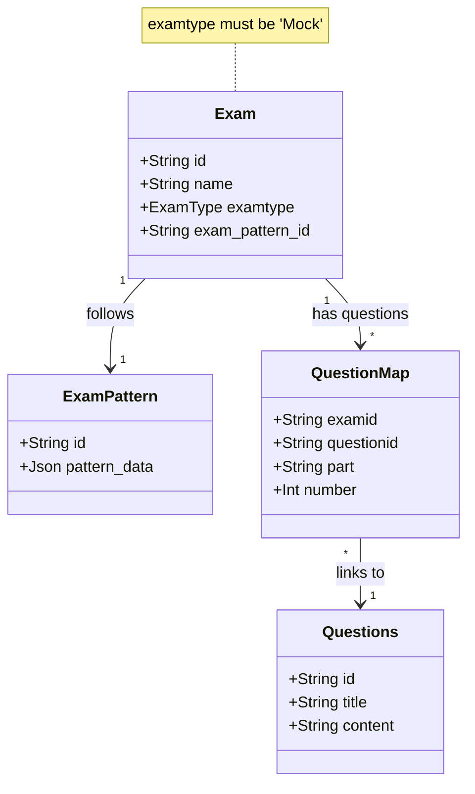

# Mock Question Set API Documentation

**Base URL**: `/api/v1/admin/mock`
**Authentication**: Requires Admin access (`isAdmin` middleware).

## Endpoints

### 1. Create Mock Question Set
Creates a new Exam of type 'Mock'.

*   **URL**: `/create`
*   **Method**: `POST`
*   **Body Parameters**:
    *   `name` (string): Name of the mock set.
    *   `description` (string, optional): Description of the mock set.
    *   `exam_pattern_id` (string): ID of the exam pattern.
    *   `isPublic` (boolean, optional): Visibility status.
    *   `access_type` (string, optional): 'Free' or 'Paid'.
*   **Success Response**:
    *   `success`: true
    *   `message`: "Mock Mock Question Set created successfully"
    *   `data`: Created Exam object.

### 2. Get All Mock Sets
Retrieves all mock question sets created by the user or are public.

*   **URL**: `/getall`
*   **Method**: `GET`
*   **Success Response**:
    *   `success`: true
    *   `message`: Status message.
    *   `data`: Array of Exam objects.

### 3. Get Mock Set by ID
Retrieves details of a specific mock set.

*   **URL**: `/get`
*   **Method**: `GET`
*   **Query Parameters**:
    *   `id` (string): The ID of the mock set.
*   **Success Response**:
    *   `success`: true
    *   `data`: Exam object with pattern details.

### 4. Get Questions for Mock Set
Retrieves all questions associated with a mock set.

*   **URL**: `/get/questions`
*   **Method**: `GET`
*   **Query Parameters**:
    *   `id` (string): The ID of the mock set.
*   **Success Response**:
    *   `success`: true
    *   `data`: Array of mapped questions.

### 5. Get Syllabus for Mock Set
Retrieves the syllabus/topics from the exam pattern of the mock set.

*   **URL**: `/topics`
*   **Method**: `GET`
*   **Query Parameters**:
    *   `id` (string): The ID of the mock set.
*   **Success Response**:
    *   `success`: true
    *   `data`: Syllabus details.

### 6. Add Question to Mock Set
Adds a question to a specific mock set.

*   **URL**: `/question/add`
*   **Method**: `POST`
*   **Body Parameters**:
    *   `mockId` (string): ID of the mock set.
    *   `questionId` (string): ID of the question to add.
    *   `part` (string, default: "part1"): Exam part.
    *   `number` (number): Question number in the set.
*   **Success Response**:
    *   `success`: true
    *   `message`: "Question added to Mock Set"
    *   `data`: Created mapping object.

### 7. Remove Question from Mock Set
Removes a question from a mock set.

*   **URL**: `/question/remove`
*   **Method**: `POST`
*   **Body Parameters**:
    *   `mockId` (string): ID of the mock set.
    *   `questionId` (string): ID of the question to remove.
*   **Success Response**:
    *   `success`: true
    *   `message`: "Question removed from Mock Set"

### 8. Get Available Mock Set IDs
Retrieves a list of available public mock sets.

*   **URL**: `/getids`
*   **Method**: `GET`
*   **Success Response**:
    *   `success`: true
    *   `data`: Array of mock set summaries (id, name).
## Architecture

The following diagram illustrates the relationship between Mock Exams, Patterns, and Questions.

### Flow of Operations

1.  **Creation**: Admin creates an `Exam` with `examtype="Mock"`.
2.  **Assignment**: Admin links `Questions` to the `Exam` via `QuestionMap` using `addQuestionTotalMockSet`.
3.  **Retrieval**: `MockService` fetches `Questions` by joining `Exam` -> `QuestionMap` -> `Questions`.
