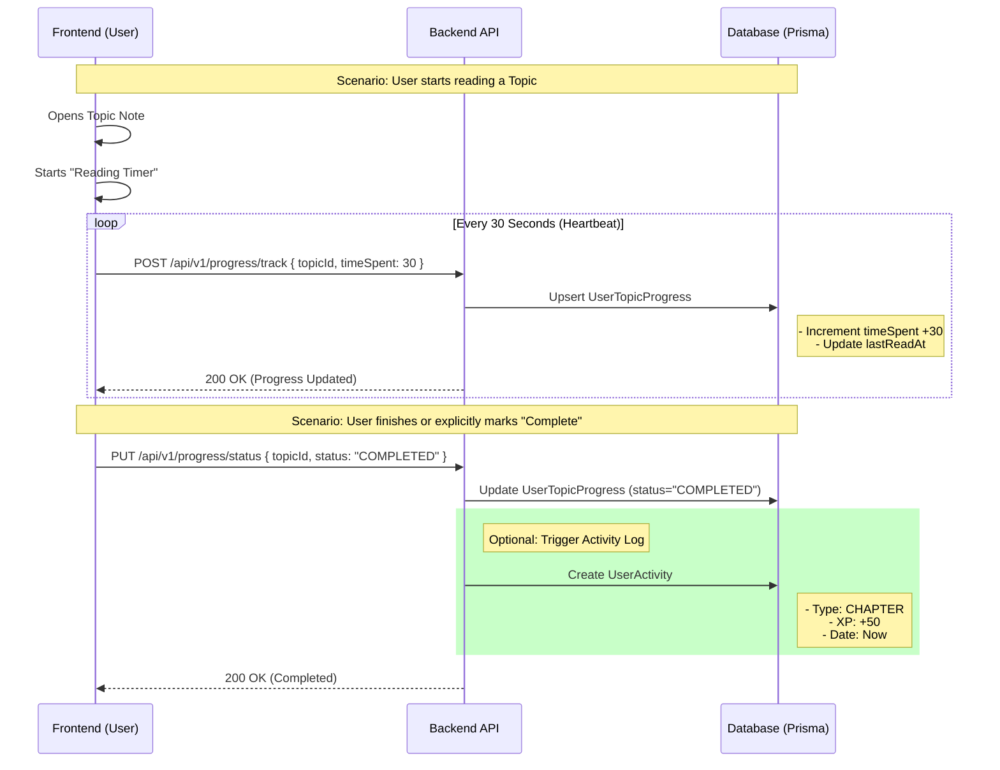

# Progress vs. Activity Flow Explanation

This document explains the data flow for tracking User Progress (State) and User Activity (Events) in the application.

## 1. Core Concepts

*   **Progress (`UserTopicProgress`)**: Represents the *current state* of a user's journey through a specific topic.
    *   *Type*: Mutable (Updates constantly).
    *   *Example*: "User has read 45% of Algebra."
    *   *Use Case*: Resuming where left off, Syllabus Coverage bars.

*   **Activity (`UserActivity`)**: Represents a *log of distinct events* that occurred at a specific time.
    *   *Type*: Immutable (Append-only).
    *   *Example*: "User finished Algebra chapter on Dec 21st at 10 AM."
    *   *Use Case*: Streaks, Heatmaps, Leaderboards, XP Calculation.

## 2. Data Flow Diagram

## 3. Detailed Step-by-Step

### A. The "Heartbeat" (Progress Tracking)
1.  **Frontend**: When a user is on a Note page, a background timer runs.
2.  **API Call**: Every 30-60 seconds, the frontend calls `POST /api/v1/progress/track`.
3.  **Backend**:
    *   Finds the specific `UserTopicProgress` record for that user + topic.
    *   Increments the `timeSpent` counter.
    *   Sets `status` to `IN_PROGRESS` if it was `NOT_STARTED`.
    *   Updates `lastReadAt` timestamp.
    *   *Note*: This does **not** create a `UserActivity` log yet. It just updates the state.

### B. Completion (The Milestone)
1.  **Trigger**: User clicks "Mark as Read" OR the system detects they reached the bottom of the page (with sufficient time spent).
2.  **API Call**: Frontend calls `PUT /api/v1/progress/status` with `COMPLETED`.
3.  **Backend**:
    *   Updates `UserTopicProgress` status to `COMPLETED`.
    *   *(Recommended Extension)*: Service creates a new `UserActivity` entry.
        *   `type`: `CHAPTER` (or `OTHER` mapped to Note).
        *   `xp`: Awards XP to the user.
        *   `date`: Current timestamp.

### C. The Result (Analytics)
*   **Syllabus Bar**: Queries `UserTopicProgress` to see how many topics are `COMPLETED` vs Total Topics.
*   **Heatmap / Streak**: Queries `UserActivity` to see if the user was active today. Since completing a chapter logged an activity, today is marked as "Active".

## 4. Why separation is important?
If you logged an "Activity" every 30 seconds while reading, the user would generate thousands of spammy records.
*   **Progress** handles the granular, high-frequency updates.
*   **Activity** records the meaningful milestones.
